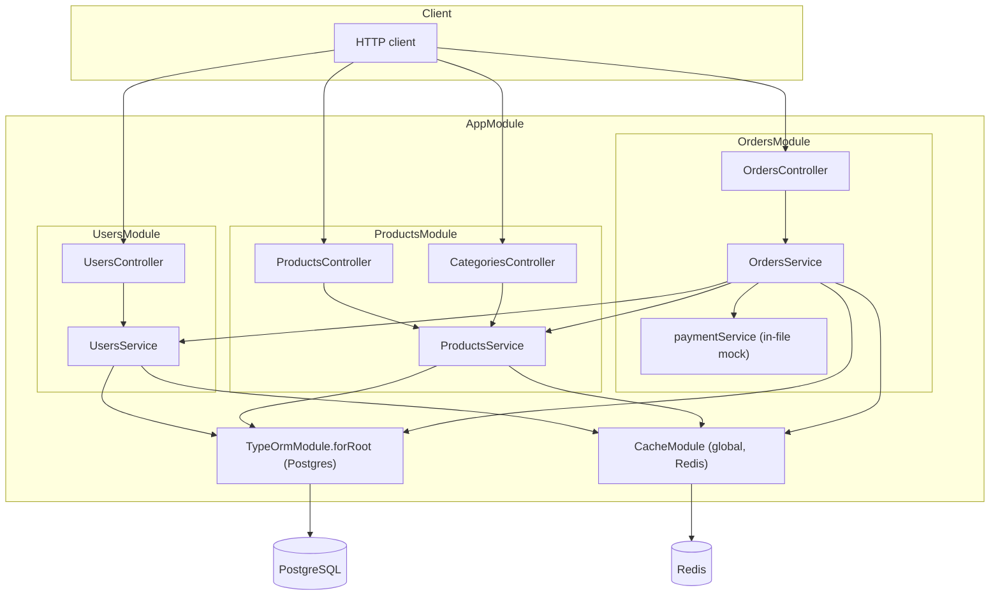
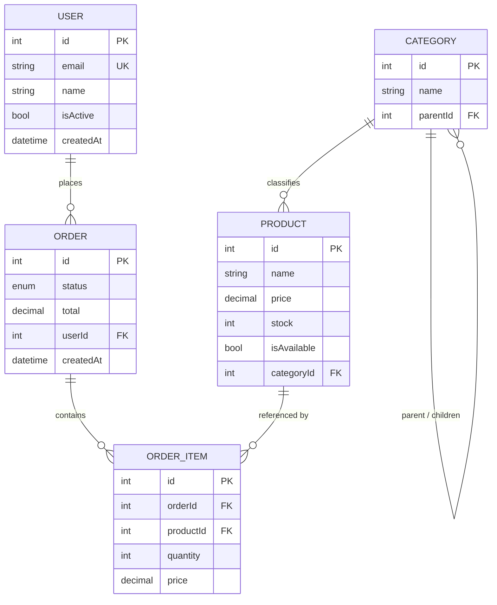
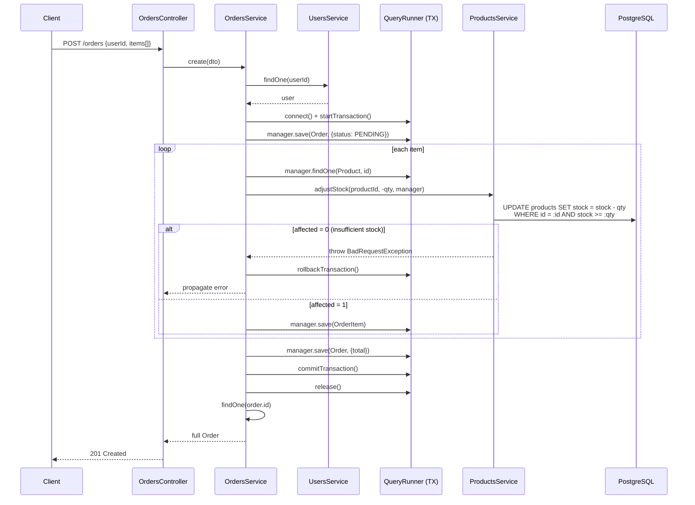
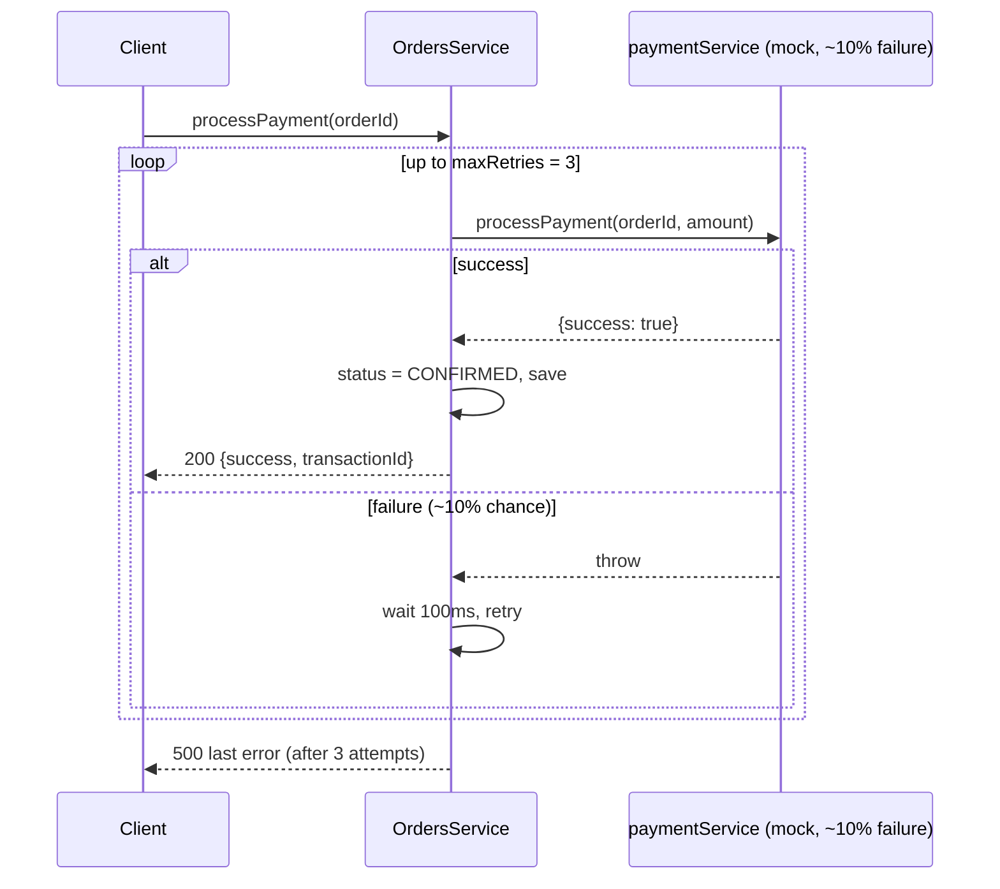

# Architecture — Low-Level Design

This document describes the system as it stands after the debugging pass:
what each piece does, how requests flow through it, and — inline — where
the reported symptoms originated and what changed to fix them. No modules,
endpoints, or entities were added or removed; this is the same system,
corrected.

## 1. Stack

| Layer | Technology |
|---|---|
| Framework | NestJS 11 (Express adapter) |
| Language | TypeScript |
| Primary DB | PostgreSQL via TypeORM (`synchronize: true`, no migrations) |
| Cache | Redis via `cache-manager` + `cache-manager-ioredis-yet` |
| Validation | `class-validator` / `class-transformer`, global `ValidationPipe({ transform: true })` |

## 2. Module / component diagram

`OrdersModule` imports `UsersModule` and `ProductsModule` and calls into
their services directly (no message bus / event layer — synchronous
in-process calls, appropriate at this scale).

## 3. Entity-relationship diagram

**Eager relations** (unchanged, part of the given design — see §7): `Order.user`,
`Order.items`, `OrderItem.product`, `Product.category` are all
`eager: true`. Every `Order` fetch therefore pulls the full
order → items → product → category graph automatically. `Category.parent`
and `Category.children` are **not** eager, which is what made the category
tree bug possible (§6.3).

## 4. Request flow — `POST /orders` (create)

Everything inside the transaction commits together or not at all — a
failure on item *N* undoes items `1..N-1` too, including their stock
decrements. `cancel()` follows the same shape in reverse (positive stock
deltas).

## 5. Request flow — `POST /orders/:id/pay`

`maxRetries` was `1000`; a client could be left waiting for the retry loop
to exhaust for a very long time before it either succeeded or failed. `3`
keeps the retry-with-backoff behavior the README advertises while bounding
worst-case latency to a handful of round trips.

## 6. Caching layout

| Service | Key pattern | TTL | Invalidated on |
|---|---|---|---|
| `UsersService` | `user:{id}` | 60s | `remove(id)` |
| `UsersService` | `users:all` | 60s | `create()`, `remove(id)` |
| `ProductsService` | `product-search:{normalized query}` | 60s | `create()`, `remove()`, `adjustStock()` |

Each service owns and invalidates its own keys manually (no interceptor,
no centralized cache layer) — this is the existing pattern from
`UsersService`; `ProductsService.searchProducts` did not follow it before
this fix (§6.4).

## 7. Where it broke, and what changed

| # | Symptom (from `INSTRUCTIONS.md`) | Component | Root cause | Fix |
|---|---|---|---|---|
| 1 | Data sometimes inconsistent/missing; intermittent errors | `OrdersService.create` | Missing `await`, stock written as a stale absolute value, no transaction | Wrapped in a `QueryRunner` transaction; atomic conditional `UPDATE` for stock |
| 2 | Requests extremely slow or never complete | `OrdersService.processPayment` | `maxRetries = 1000` against a ~10%-failure mock | Bounded to `3` retries |
| 3 | Vague/misleading errors | `OrdersService.getOrderWithFullDetails` | Genuine circular reference before `JSON.stringify` | Replaced the back-reference with a small non-circular summary |
| 4 | Cache doesn't match expectations | `ProductsService.searchProducts` | Single hardcoded cache key for every query | Query-scoped key + invalidation on writes |
| 5 | Vague errors / missing data | `ProductsService.getCategoryTree` | Recursion into ORM relations only loaded 1 level deep | Tree built from an in-memory map of all categories |
| 6 | Vague errors (in logs) | `ProductsService.processProductBatch` | Swallowed the real error | Logs the actual caught error |

Full root-cause narrative, code excerpts, and the reasoning behind each fix
are in [`FIXES.md`](./FIXES.md).

## 8. Explicitly out of scope

Per `INSTRUCTIONS.md` ("do not add new features or redesign the system"),
the following were left untouched even though they diverge from what a
greenfield design might choose:

- **Eager relations** (`Order.user`, `Order.items`, `OrderItem.product`,
  `Product.category`) — a real N+1/payload-size cost, but changing the
  loading strategy would alter response shapes across every consumer of
  these entities. Flagged in `CLAUDE.md`, not one of the reported symptoms.
- **No auth/authorization layer** — all endpoints remain open, as given.
- **`synchronize: true`, no migrations** — kept as the existing dev-mode
  setup.
- **The `JSON.parse(JSON.stringify(...))` round-trip** in
  `getOrderWithFullDetails` — kept (it plain-ifies decimal/date fields);
  only the circular input feeding it was fixed.
- **In-memory `searchCacheKeys` registry** in `ProductsService` — a fresh
  `Set` per process, cleared on writes, is adequate for this
  single-instance app; a multi-instance deployment would need a
  Redis-side key registry or pattern-scan instead. Noted as a follow-up,
  not implemented, to stay within "fix the bug" scope.

